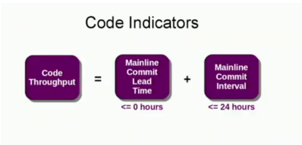
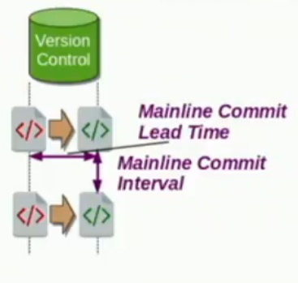
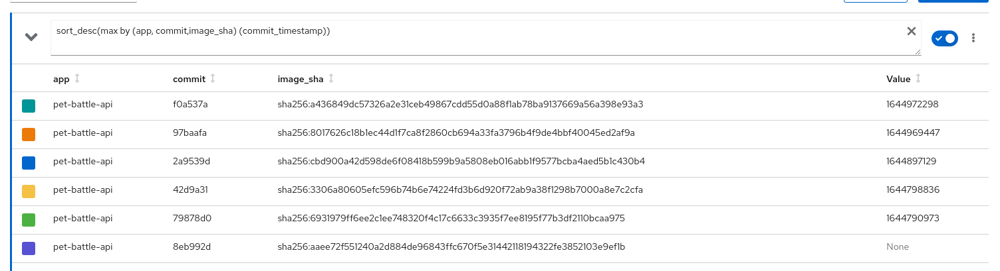

# delivery-metrics-intervals

Measuring Continuous Delivery

## Code Throughput Indicator

If you are building frequently, you have the opportunity to deploy frequently. So continuous integration is a key enabler of continuous delivery.



CI is a practice where everyone commits to master at least once a day.

If you are using Trunk Based Development the lead time will be zero ! yay ! (* not calculating lead time in this example yet)

We can't measure stability on local main commits only throughput.

Mainline commit interval - difference in [hr] between mainline commits.



## Pelorus Data

Measured from commit-time metrics from pelorus. Currently this is a WIP demo of

- binary builds on OpenShift
- collect commit metrics from Builds



## Results

This app calculates `average` and `stedev` in `[hr]` gauge metric for the `commit interval` (this is the time delta between the commits) 

```bash
$ http localhost:8080/cd-metrics/commit-interval
HTTP/1.1 200 OK
Content-Type: application/json
content-length: 52

{
    "avg": 12.59201388888889,
    "stdev": 11.403846069823139
}
```

```bash
$ http localhost:8080/q/metrics | grep commit_interval
# HELP cd:commit_interval:avg  
# TYPE cd:commit_interval:avg gauge
cd:commit_interval:avg{app="pet-battle-api",} 12.59201388888889
# HELP cd:commit_interval:stdev  
# TYPE cd:commit_interval:stdev gauge
cd:commit_interval:stdev{app="pet-battle-api",} 11.403846069823139
```
